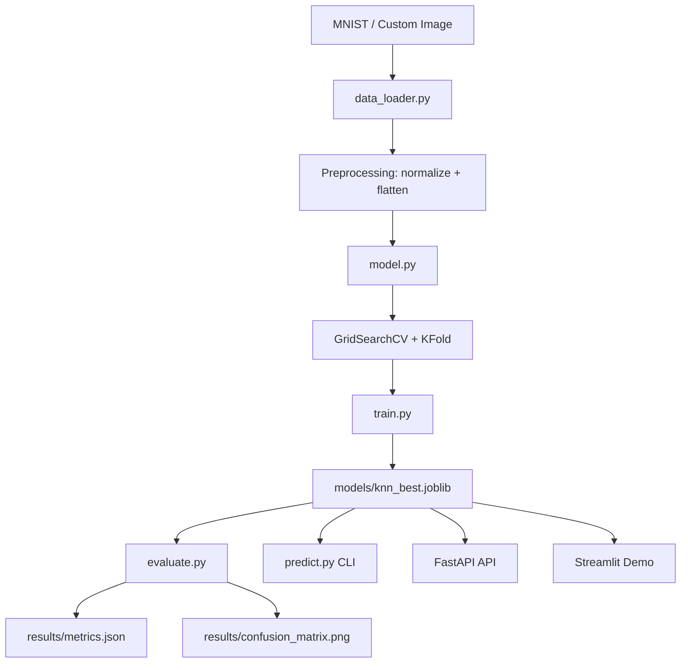

# Handwritten Digit Recognition


Production-style machine learning project for classifying handwritten digits (0-9) from MNIST using a tuned KNN model, reproducible training/evaluation pipelines, and CI-tested code quality.

Live repository: <https://github.com/nishant2-1/HANDWRITTENDIGITRECO>

## Live Deployment

Production API (Vercel):

- Base URL: <https://handwrittendigitrecognization.vercel.app>
- Health Check: <https://handwrittendigitrecognization.vercel.app/health>
- API Docs (Swagger): <https://handwrittendigitrecognization.vercel.app/docs>

Example prediction request:

```bash
curl -X POST "https://handwrittendigitrecognization.vercel.app/predict" \
    -F "file=@examples/portfolio_samples/digit_7.png"
```

## Table of Contents

- [Overview](#overview)
- [Architecture](#architecture)
- [Project Structure](#project-structure)
- [How It Works](#how-it-works)
- [Portfolio Pitch](#portfolio-pitch)
- [Portfolio Description Templates](#portfolio-description-templates)
- [Live Deployment](#live-deployment)
- [Setup](#setup)
- [Run the Project](#run-the-project)
- [Run with Docker](#run-with-docker)
- [Deploy API on Vercel](#deploy-api-on-vercel)
- [Portfolio Demo Checklist](#portfolio-demo-checklist)
- [Outputs and Artifacts](#outputs-and-artifacts)
- [Performance](#performance)
- [Interview Talking Points](#interview-talking-points)
- [Testing and CI](#testing-and-ci)
- [Troubleshooting](#troubleshooting)
- [Roadmap](#roadmap)
- [License](#license)

## Overview

This project is designed to be both:

- Educational: clear modular code and notebook exploration
- Practical: CLI pipeline, saved model artifacts, metrics tracking, and GitHub Actions CI

Core capabilities:

- MNIST loading and vectorized preprocessing
- KNN model with GridSearchCV and 5-fold K-Fold cross-validation
- Fast mode and full mode training
- Evaluation with classification report, confusion matrix, and latency measurement
- Single-image prediction with class confidence scores
- FastAPI inference API for backend showcase
- Streamlit demo app for interactive frontend showcase
- Top-3 prediction view with confidence ranking
- Uncertainty threshold handling for low-confidence inputs
- Preprocessing preview that shows the 28x28 model-ready image

## Architecture



## Project Structure

```text
handwritten-digit-recognition/
├── README.md
├── CHANGELOG.md
├── requirements.txt
├── .gitignore
├── pyrightconfig.json
├── pyproject.toml
├── Makefile
├── Dockerfile
├── docker-compose.yml
├── .dockerignore
├── notebooks/
│   └── exploration.ipynb
├── examples/
│   └── README.md
├── api/
│   ├── __init__.py
│   └── main.py
├── app/
│   └── streamlit_app.py
├── src/
│   ├── __init__.py
│   ├── constants.py
│   ├── data_loader.py
│   ├── model.py
│   ├── train.py
│   ├── evaluate.py
│   ├── predict.py
│   └── version.py
├── tests/
│   ├── __init__.py
│   ├── test_model.py
│   └── test_api.py
├── models/
│   └── knn_best.joblib
└── results/
     ├── metrics.json
     ├── training_metrics.json
     └── confusion_matrix.png
```

## How It Works

1. `src/data_loader.py`
    - Loads MNIST from TensorFlow
    - Normalizes pixels to [0, 1]
    - Flattens images to 784 features for KNN
    - Supports custom image preprocessing with PIL/OpenCV

2. `src/model.py`
    - Defines KNN classifier (`metric=minkowski`, `algorithm=ball_tree`)
    - Runs `GridSearchCV` over neighbors/weights/metric options
    - Uses 5-fold cross-validation via `KFold`

3. `src/train.py`
    - Executes end-to-end training pipeline
    - Saves model to `models/knn_best.joblib`
    - Saves training metadata to `results/training_metrics.json`

4. `src/evaluate.py`
    - Loads model and evaluates on MNIST test set
    - Generates classification report and confusion matrix
    - Measures latency with `time.perf_counter`
    - Saves final output to `results/metrics.json`

5. `src/predict.py`
    - CLI inference from image path
    - Prints predicted digit and confidence for each class
    - Provides top-k predictions and uncertainty-aware output metadata

6. `app/streamlit_app.py`
    - Displays top-3 classes and confidence percentages
    - Flags low-confidence uploads as uncertain
    - Shows preprocessing preview (28x28) used for model inference

## Portfolio Pitch

This repository demonstrates an end-to-end machine learning workflow that I designed and productionized for handwritten digit classification. The project covers data engineering, model selection, hyperparameter tuning, evaluation, inference, testing, and CI automation in a clean, modular Python codebase.

Why this stands out for portfolio review:

- Complete ML lifecycle: training, evaluation, prediction, and artifact management
- Reproducibility: metrics persisted to structured JSON outputs for auditing
- Performance focus: latency tracking and documented accuracy targets
- Engineering quality: unit tests, CI checks, and maintainable module boundaries

Technical impact summary:

- Test accuracy: 95.18%
- CV mean accuracy: 95.35%
- Macro F1 score: 95.16%
- Inference latency: 8.28 ms per image

## Portfolio Description Templates

Use any of these directly in your portfolio, resume, or LinkedIn profile.

### Short (1-2 lines)

Built an end-to-end handwritten digit recognition system using a tuned KNN model on MNIST, with FastAPI + Streamlit inference interfaces, CI-tested code quality, and Docker-based reproducible deployment.

### Medium (Project Summary)

Designed and implemented a production-style handwritten digit recognition project covering the full ML lifecycle: vectorized preprocessing, hyperparameter tuning (GridSearchCV + 5-fold cross-validation), model evaluation (accuracy, F1, confusion matrix, latency), and deployment-ready inference. Exposed prediction through both a FastAPI backend and a Streamlit web app with top-3 predictions, uncertainty thresholding, and preprocessing previews. Added automated tests, quality gates (lint/format/type-check), and containerized runtime support for reliable reproducibility.

### Resume Bullet Points

- Built a modular ML pipeline for MNIST digit classification using KNN with GridSearchCV and 5-fold cross-validation.
- Achieved 95.18% test accuracy with low inference latency (8.28 ms/image) and robust metrics reporting.
- Developed FastAPI and Streamlit interfaces with top-k predictions, uncertainty handling, and preprocessing explainability.
- Productionized the project using CI quality gates, unit tests, and Dockerized workflows.

### LinkedIn Description

I built a production-style Handwritten Digit Recognition project to demonstrate end-to-end ML engineering. The system trains and evaluates a tuned KNN model on MNIST, then serves predictions through FastAPI and Streamlit. I added top-3 confidence outputs, uncertainty threshold handling, preprocessing previews, automated tests, CI quality checks, and Docker support. This project reflects both model performance and real-world software engineering practices.

## Setup

```bash
# Clone
git clone https://github.com/nishant2-1/HANDWRITTENDIGITRECO.git
cd HANDWRITTENDIGITRECO

# Create env
python -m venv .venv

# Activate env (macOS/Linux)
source .venv/bin/activate

# Activate env (Windows PowerShell)
.venv\Scripts\Activate.ps1

# Install dependencies
pip install -r requirements.txt

# Optional: run project helper commands
make help
```

## Run the Project

### 1) Train

```bash
# Fast mode (recommended for quick iteration)
python -m src.train

# Full mode (more expensive)
python -m src.train --full
```

### 2) Evaluate

```bash
python -m src.evaluate
```

### 3) Predict from a custom image

```bash
python -m src.predict --image examples/your_digit.png
```

### 4) Run tests

```bash
pytest tests -v
```

### 5) Start FastAPI backend

```bash
python -m uvicorn api.main:app --host 0.0.0.0 --port 8000 --reload
```

Open API docs at: <http://127.0.0.1:8000/docs>

### 6) Launch Streamlit demo UI

```bash
python -m streamlit run app/streamlit_app.py
```

The Streamlit app now includes:

- Top-3 predictions table
- Adjustable uncertainty threshold (sidebar)
- Preprocessing preview image used by the model

## Run with Docker

Use Docker when you want one-command startup without local Python dependency setup.

Prerequisites:

- Docker Desktop installed and running
- Port `8000` (API) and `8501` (Streamlit) available

Step-by-step:

1. Build images

```bash
docker compose build
```

1. Start services

```bash
docker compose up -d
```

1. Open endpoints

- API docs: `http://127.0.0.1:8000/docs`
- Streamlit demo: `http://127.0.0.1:8501`

1. Stop services

```bash
docker compose down
```

Tip: If you update dependencies or Dockerfile, rebuild with `docker compose build`.

## Deploy API on Vercel

Use Vercel for the FastAPI backend deployment used in your portfolio demo.

Important:

- This repository deploys the API to Vercel.
- Streamlit is not recommended on Vercel serverless functions; deploy Streamlit separately (for example Streamlit Community Cloud or Render) and keep API on Vercel.

### Prerequisites

- Vercel account
- Vercel CLI installed (`npm i -g vercel`) or use Vercel web import flow
- Model artifact present in repository: `models/knn_best.joblib`

### One-time project setup

1. Login:

```bash
vercel login
```

1. From project root, link and deploy preview:

```bash
vercel
```

Vercel will detect:

- `vercel.json` (routes all traffic to FastAPI)
- `api/index.py` (ASGI entrypoint)
- `api/requirements.txt` (lean API-only dependencies)

### Production deploy

```bash
vercel --prod
```

### Verify deployment

- Health: `https://<your-vercel-domain>/health`
- Docs: `https://<your-vercel-domain>/docs`
- Predict: `POST https://<your-vercel-domain>/predict` with multipart file upload

### Example test with curl

```bash
curl -X POST "https://<your-vercel-domain>/predict" \
    -F "file=@examples/portfolio_samples/digit_7.png"
```

## Portfolio Demo Checklist

Use this sequence during interviews or portfolio walkthroughs.

1. Activate your environment and run one command:

```bash
make portfolio-demo
```

1. Show automated quality checks in terminal output:
    - Dependency install
    - Test execution
    - Evaluation artifact generation

1. Open API docs and run `/health` and `/predict`:
    - <http://127.0.0.1:8000/docs>

1. Open the interactive demo and upload a digit image:
    - <http://127.0.0.1:8501>

1. Show practical robustness features in UI:
    - Top-3 predictions
    - Uncertainty warning for low-confidence inputs
    - 28x28 preprocessing preview

1. Show saved metrics and confusion matrix artifacts:
    - `results/metrics.json`
    - `results/confusion_matrix.png`

1. Highlight engineering maturity:
    - CI workflow in `.github/workflows/ci.yml`
    - API implementation in `api/main.py`
    - Modular training/evaluation pipeline in `src/`

## What You Need To Do

1. Create and activate a virtual environment.
2. Run `pip install -r requirements.txt`.
3. Train once with `python -m src.train` to generate the model file.
4. Evaluate using `python -m src.evaluate`.
5. For backend showcase, run FastAPI and open `/docs`.
6. For frontend showcase, run Streamlit and test with custom digit images.

## Outputs and Artifacts

- `models/knn_best.joblib`: trained KNN model
- `results/training_metrics.json`: training time, CV scores, best parameters
- `results/metrics.json`: evaluation report + latency + merged metadata
- `results/confusion_matrix.png`: confusion matrix visualization

## Performance

| Metric             | Value   |
|--------------------|---------|
| Test Accuracy      | 95.18%  |
| CV Mean Accuracy   | 95.35%  |
| CV Std Deviation   | 0.24%   |
| Macro F1 Score     | 95.16%  |
| Prediction Latency | 8.28 ms |
| Latency Target     | <100 ms |

## Interview Talking Points

Use these points while presenting the project:

1. Problem framing
    - Multi-class classification problem on image data.
    - Selected KNN for interpretable baseline with strong MNIST performance.

2. Data and preprocessing
    - Loaded MNIST with TensorFlow dataset utilities.
    - Applied vectorized normalization and flattening for efficient KNN input.
    - Added custom image preprocessing path to support real user inputs.

3. Model development
    - Used GridSearchCV with 5-fold K-Fold CV for robust model selection.
    - Tuned neighbors, distance metric, and weighting strategy.
    - Chose ball_tree search for practical speed improvements.

4. Evaluation strategy
    - Reported precision, recall, F1, and confusion matrix.
    - Measured per-image latency with high-resolution timers.
    - Persisted training and evaluation artifacts for traceability.

5. Software engineering choices
    - Modularized source files by responsibility.
    - Added tests for preprocessing and model behavior.
    - Enabled CI automation for reliable repository quality gates.

## Testing and CI

- Local tests: `pytest tests -q`
- GitHub Actions workflow: `.github/workflows/ci.yml`
- CI quality gates: Ruff lint, Black format check, Mypy type check, Pytest
- CI runs automatically on push and pull requests to `main`

## Troubleshooting

1. VS Code shows unresolved imports but scripts run
    - Select the correct interpreter in VS Code: Command Palette -> `Python: Select Interpreter`
    - Pick your project virtual environment

2. TensorFlow import warning in editor
    - Ensure TensorFlow package is installed in the selected interpreter
    - Run: `pip install tensorflow`

3. Model file not found during evaluation/predict
    - Run training first: `python -m src.train`

## Roadmap

- Add model registry style versioning and release tags
- Add richer CLI/reporting for class-wise analysis

## License

MIT
