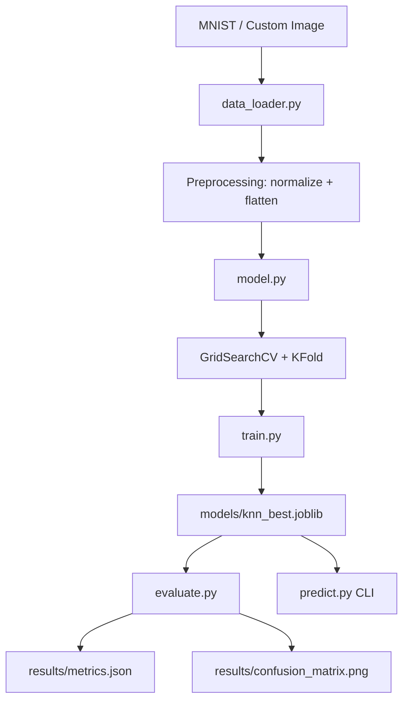

# Handwritten Digit Recognition


Production-style machine learning project for classifying handwritten digits (0-9) from MNIST using a tuned KNN model, reproducible training/evaluation pipelines, and CI-tested code quality.

## Table of Contents

- [Overview](#overview)
- [Architecture](#architecture)
- [Project Structure](#project-structure)
- [How It Works](#how-it-works)
- [Setup](#setup)
- [Run the Project](#run-the-project)
- [Outputs and Artifacts](#outputs-and-artifacts)
- [Performance](#performance)
- [Testing and CI](#testing-and-ci)
- [Troubleshooting](#troubleshooting)
- [Roadmap](#roadmap)
- [License](#license)

## Overview

This project is designed to be both:

- Educational: clear modular code and notebook exploration
- Practical: CLI pipeline, saved model artifacts, metrics tracking, and GitHub Actions CI

Core capabilities:

- MNIST loading and vectorized preprocessing
- KNN model with GridSearchCV and 5-fold K-Fold cross-validation
- Fast mode and full mode training
- Evaluation with classification report, confusion matrix, and latency measurement
- Single-image prediction with class confidence scores

## Architecture



## Project Structure

```text
handwritten-digit-recognition/
├── README.md
├── CHANGELOG.md
├── requirements.txt
├── .gitignore
├── pyrightconfig.json
├── notebooks/
│   └── exploration.ipynb
├── examples/
│   └── README.md
├── src/
│   ├── __init__.py
│   ├── constants.py
│   ├── data_loader.py
│   ├── model.py
│   ├── train.py
│   ├── evaluate.py
│   ├── predict.py
│   └── version.py
├── tests/
│   ├── __init__.py
│   └── test_model.py
├── models/
│   └── knn_best.joblib
└── results/
     ├── metrics.json
     ├── training_metrics.json
     └── confusion_matrix.png
```

## How It Works

1. `src/data_loader.py`
    - Loads MNIST from TensorFlow
    - Normalizes pixels to [0, 1]
    - Flattens images to 784 features for KNN
    - Supports custom image preprocessing with PIL/OpenCV

2. `src/model.py`
    - Defines KNN classifier (`metric=minkowski`, `algorithm=ball_tree`)
    - Runs `GridSearchCV` over neighbors/weights/metric options
    - Uses 5-fold cross-validation via `KFold`

3. `src/train.py`
    - Executes end-to-end training pipeline
    - Saves model to `models/knn_best.joblib`
    - Saves training metadata to `results/training_metrics.json`

4. `src/evaluate.py`
    - Loads model and evaluates on MNIST test set
    - Generates classification report and confusion matrix
    - Measures latency with `time.perf_counter`
    - Saves final output to `results/metrics.json`

5. `src/predict.py`
    - CLI inference from image path
    - Prints predicted digit and confidence for each class

## Setup

```bash
# Clone
git clone https://github.com/nishant2-1/HANDWRITTENDIGITRECO.git
cd HANDWRITTENDIGITRECO

# Create env
python -m venv .venv

# Activate env (macOS/Linux)
source .venv/bin/activate

# Activate env (Windows PowerShell)
.venv\Scripts\Activate.ps1

# Install dependencies
pip install -r requirements.txt
```

## Run the Project

### 1) Train

```bash
# Fast mode (recommended for quick iteration)
python -m src.train

# Full mode (more expensive)
python -m src.train --full
```

### 2) Evaluate

```bash
python -m src.evaluate
```

### 3) Predict from a custom image

```bash
python -m src.predict --image examples/your_digit.png
```

### 4) Run tests

```bash
pytest tests -v
```

## Outputs and Artifacts

- `models/knn_best.joblib`: trained KNN model
- `results/training_metrics.json`: training time, CV scores, best parameters
- `results/metrics.json`: evaluation report + latency + merged metadata
- `results/confusion_matrix.png`: confusion matrix visualization

## Performance

| Metric             | Value   |
|--------------------|---------|
| Test Accuracy      | 95.18%  |
| CV Mean Accuracy   | 95.35%  |
| CV Std Deviation   | 0.24%   |
| Macro F1 Score     | 95.16%  |
| Prediction Latency | 8.28 ms |
| Latency Target     | <100 ms |

## Testing and CI

- Local tests: `pytest tests -q`
- GitHub Actions workflow: `.github/workflows/ci.yml`
- CI runs automatically on push and pull requests to `main`

## Troubleshooting

1. VS Code shows unresolved imports but scripts run
    - Select the correct interpreter in VS Code: Command Palette -> `Python: Select Interpreter`
    - Pick your project virtual environment

2. TensorFlow import warning in editor
    - Ensure TensorFlow package is installed in the selected interpreter
    - Run: `pip install tensorflow`

3. Model file not found during evaluation/predict
    - Run training first: `python -m src.train`

## Roadmap

- Add Docker support for reproducible runtime
- Add model registry style versioning and release tags
- Add richer CLI/reporting for class-wise analysis

## License

MIT
